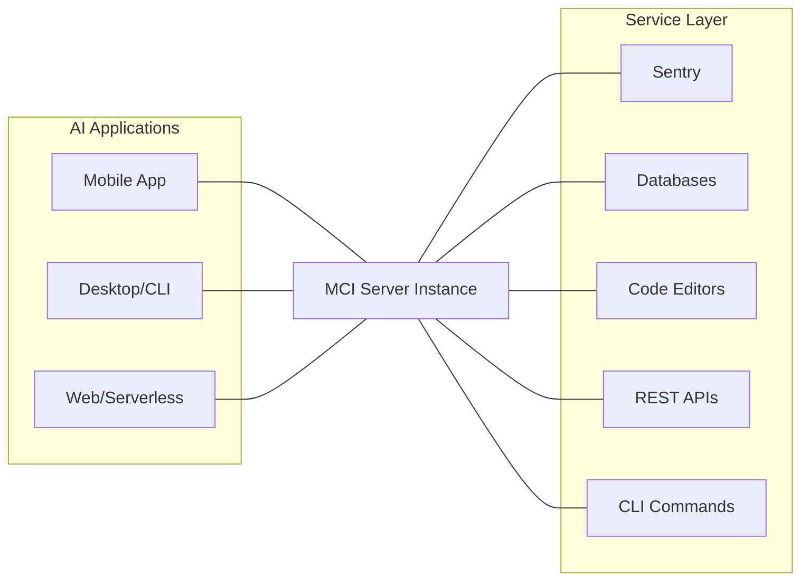
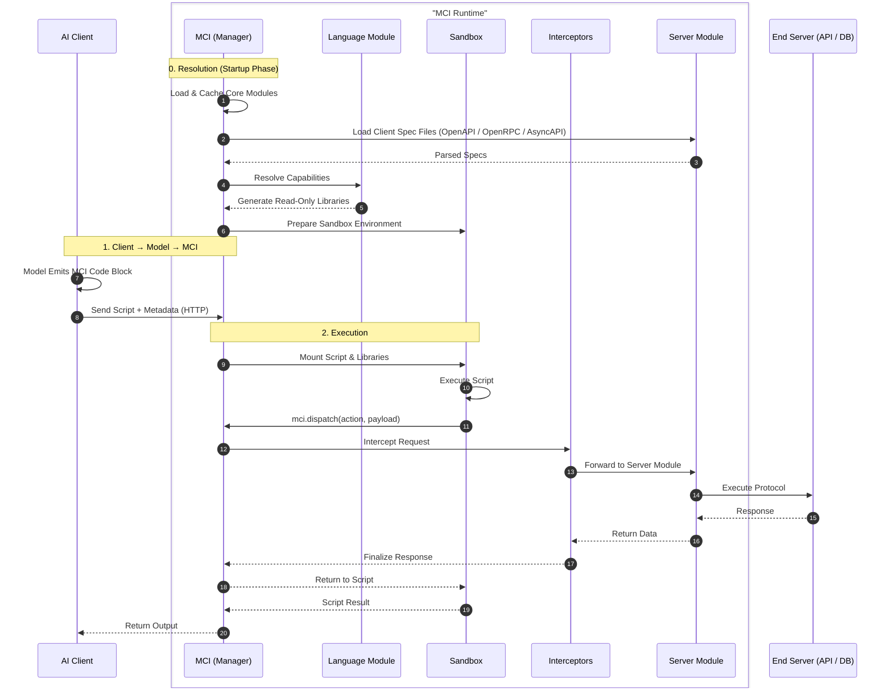

This document provides a comprehensive overview of the **Model Control
Interface (MCI)**, covering its operational scope, core concepts, and
structural design.

## System Architecture

MCI utilizes a centralized **Client-Proxy-Server** model. By acting as a
unified gateway, it eliminates the need for AI applications to manage multiple
complex integrations.

## Core Components

### **The Client (AI Application)**

Clients are the "consumers" of the architecture. An MCI client can be any
interface, ranging from mobile apps to serverless functions, capable of
receiving model output and executing HTTP requests.

### **The Server (The Proxy)**

The MCI Server is the central intelligence of the system. It acts as a
**Reverse Proxy**, managing authentication, request transformation, and
communication between the Client and the external environment.

### **The Service (The Providers)**

These are the functional targets that perform specific tasks or store data.

- **REST Servers:** Traditional web services.
- **Database Engines:** Direct data persistence layers.
- **Execution Environments:** CLI tools, code editors, or message consumers.

## How It Works: The Execution Life-cycle

**MCI** is the "brain" of the operation, It manages the environment and
coordinates five distinct types of modules to process the request:

| **Module Type** | **Primary Function** |
| - | - |
| **Sandbox**     | The secure, isolated environment (container/VM) where the script is executed. It mounts a shared directory for code and libraries. |
| **Server**      | Acts as the reverse proxy to specific protocols (REST, GraphQL, gRPC). It receives requests from dispatches and relays them to the end service. |
| **Interceptor** | Middleware functions that sit between the script and the service. Used for logging, security filtering, or request modification. |
| **Hook**        | Event-driven peripherals. They inject external notifications (e.g., a GitHub Webhook) directly back to the model's context. |
| **Language**    | Generates language specific libraries to be used by the model to execute actions in the sandbox. |

### 0. Resolution

When MCI is span up it caches and loads its modules in preparation for
execution.

1. **Library Generation:** MCI loads all is client spec files. Client spec
  files are documents tat specify a standard for communication between an MCI
  server module and the end server. Examples of these are `OpenAPI`, `OpenRPC`,
  `AsyncAPI` etc. MCI ten resolves active server modules that use the client
  definition documents and passes the generated objects to the language
  module which take these objects and generates a **temporary, read-only
  library** representing available capabilities.
2. **Mounting:** The script and generated libraries are placed into the
  **Sandbox's** shared directory based on the language and the sandbox
  environment definition.

### 1. The Client (AI Application)

The process begins when an AI client receives a prompt. The AI client passes
the prompt to the model which generates the AI’s response.

- **Identification:** If the Model requires external context or action, it
  generates a **specialized MCI code block** instead of a standard JSON tool
  call.
- **Transmission:** The Client identifies this block, extracts the script and
  metadata, and transmits it to the **MCI Server** via HTTP.

### 2. Execution

Once the MCI receives the script:

1. **Dispatch:** The Sandbox executes the code. When the script calls a
  function (e.g. `mci.dispatch("shell.exec", { ... }, ...)`), the
  request is routed through:
  **Library** → **MCI Server** → **Interceptors** → **Server Module**.
2. **The Return Trip:** The response follows the same path back, allowing the
  script to either pipe the data into another action or return the final result
  to the Client.

