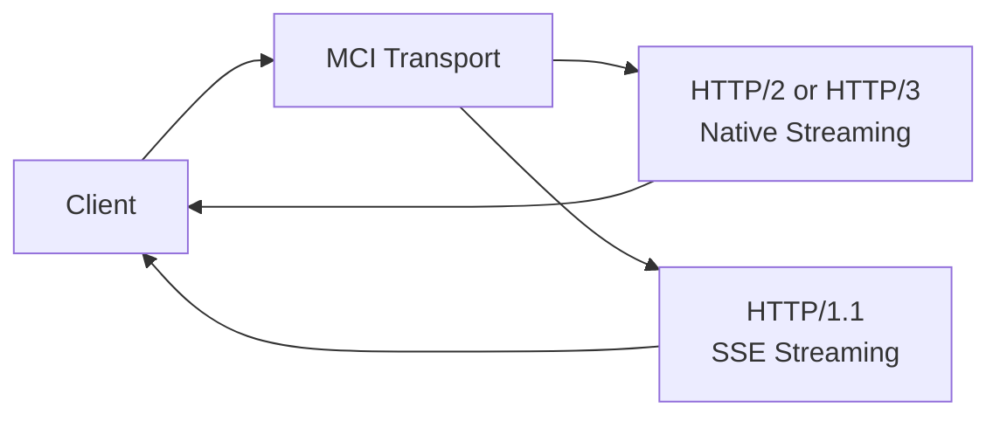

## External Transport

The MCI Server exposes a single HTTP endpoint that automatically negotiates the
most suitable transport protocol for each client connection. This allows MCI to
provide low-latency communication and continuous feedback during script
execution, regardless of the client’s capabilities or network conditions.

### Supported Protocols

MCI supports multiple versions of the HTTP standard and selects the best
available option at connection time:

- **HTTP/1.1:** A universally supported fallback for legacy clients.
- **HTTP/2:** A modern, multiplexed transport that enables efficient request
  handling and streaming over a single connection.
- **HTTP/3:** A QUIC-based transport optimized for unreliable or high-latency
  networks, improving resilience and tail latency.

Clients do not need to explicitly choose a protocol; negotiation is handled
automatically by the transport layer.

### Streaming & Real-Time Feedback

Script execution inside the Sandbox may be long-running. To keep the Client
informed, MCI streams execution progress in real time, including logs, partial
results, and error signals.

- **Native Streaming (HTTP/2 & HTTP/3)**
    When connected over HTTP/2 or HTTP/3, MCI uses native stream framing to
    provide efficient, bidirectional communication over a single connection.
    This enables low-overhead delivery of incremental updates while execution
    is still in progress.
- **SSE Fallback (HTTP/1.1)**
    For HTTP/1.1 clients, MCI transparently falls back to
    **Server-Sent Events (SSE)**. While SSE is unidirectional, it allows MCI to
    push live execution updates without polling, preserving a responsive
    execution experience for legacy clients.

### Transport Negotiation Overview

## Internal Transport

The central MCI server needs to communicate with it's modules. For this,
MCI uses WASI (WebAssembly System Interface).

[WASI](https://wasi.dev/) (the WebAssembly System Interface) provides a way to
compose software written in different programming languages *within the same
process*, without relying on costly and clunky interface systems such as
HTTP-based microservices.

By standardizing how WebAssembly modules interact with the host system, WASI
enables language-agnostic components to communicate through well-defined,
low-overhead boundaries. This makes it possible to safely embed plugins,
extensions, or shared logic written in different languages without network
serialization, service orchestration, or runtime duplication.

WASI is particularly well suited for projects that maintain SDKs across
multiple languages, including client libraries and plugin-based architectures.
A concrete example is the [Zed editor](https://zed.dev/), which uses
WebAssembly and WASI to support a fast, secure, and extensible plugin model
while preserving native-level performance.
